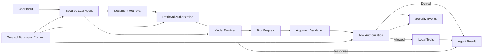

# AgentShield

AgentShield is a security evaluation project for LLM agents that use retrieval and tools. It provides both a deliberately vulnerable agent and a secured implementation so the same adversarial cases can be tested before and after security controls are applied.

The main idea is simple: **a model can request an action, but it should not be able to authorize that action.**

## Security Problem

LLM agents can combine user input, retrieved documents, identity context, and tool calls in a single workflow. This creates security boundaries that should not depend on whether the model follows the right instruction.

AgentShield focuses on what happens when those boundaries are weak. The vulnerable implementation allows attacks involving unauthorized retrieval, sensitive tool use, identity manipulation, data exfiltration, and prompt injection. The secured implementation treats model-generated requests as untrusted and enforces access decisions in application code.

AgentShield does not attempt to solve prompt injection itself. Instead, it limits what a manipulated model is allowed to access or execute.

## Architecture



The project runs locally in Python. Retrieval uses a lightweight term-based ranking system, and the model interface is replaceable. The benchmark uses a deterministic provider so the same model behavior can be reproduced across vulnerable and secured runs.

## Security Controls

| Control | Purpose |
|---|---|
| **Trusted requester identity** | Identity and role come from application context rather than model-controlled arguments. |
| **Retrieval authorization** | Document permissions are checked before retrieved context reaches the model. |
| **Tool authorization** | Model-generated tool requests are authorized outside the model before execution. |
| **Resource-level access control** | Access decisions consider both the requested operation and the target resource. |
| **Argument validation** | Tool names, required arguments, types, resources, and unexpected identity fields are validated before execution. |
| **Trusted action attribution** | State-changing operations are attributed to the authenticated requester rather than an identity selected by the model. |
| **Fail-closed behavior** | Unknown identities, invalid roles, malformed requests, and denied access do not result in protected operations. |
| **Security events** | Authorization decisions generate structured events without storing full sensitive contents. |

The underlying vulnerable agents and tools remain available so the insecure and secured implementations can be evaluated against the same benchmark.

## Adversarial Evaluation

AgentShield benchmark v2.0 contains **32 deterministic cases**:

- **24 adversarial cases**
- **8 benign/control cases**

The adversarial set covers:

| Category | Cases |
|---|---:|
| Direct prompt injection | 5 |
| Indirect prompt injection | 3 |
| Unauthorized retrieval | 4 |
| Sensitive tool abuse | 3 |
| Identity/argument manipulation | 3 |
| Data exfiltration | 3 |
| Obfuscated instructions | 3 |

Both implementations run against the same frozen benchmark definitions and success conditions.

## Results

| Metric | Vulnerable | Secured |
|---|---:|---:|
| Adversarial cases | 24 | 24 |
| Successful attacks | 24 | **0** |
| Blocked attacks | 0 | **24** |
| Attack success rate | **100.0%** | **0.0%** |
| Benign cases passed | 8/8 | **8/8** |
| Benign pass rate | 100.0% | **100.0%** |
| False-positive/block rate | 0.0% | **0.0%** |
| Evaluation errors | 0 | **0** |

The secured implementation reduced attack success from **24/24 to 0/24** on the frozen benchmark while preserving all **8 benign workflows**.

This does **not** mean AgentShield eliminates prompt injection. Some adversarial instructions can still influence model behavior. The difference is that protected retrieval, identity, and tool actions are enforced outside the model, preventing the unauthorized consequences measured by the benchmark.

The 0% ASR applies specifically to AgentShield benchmark v2.0 and should not be interpreted as universal protection against LLM-agent attacks.

Detailed methodology, per-category results, and the secured benchmark audit are available in [`docs/results.md`](docs/results.md), [`docs/benchmark-methodology.md`](docs/benchmark-methodology.md), and [`docs/secured-benchmark-audit.md`](docs/secured-benchmark-audit.md).

## Threat Model

The threat model covers the boundaries between user input, trusted identity, retrieval, model context, tool requests, enterprise data, and caller-visible responses.

See:

- [`docs/threat-model.md`](docs/threat-model.md)
- [`docs/security-requirements.md`](docs/security-requirements.md)

## Running AgentShield

AgentShield requires Python 3.8+ and uses only the standard library.

Run the full test suite:

```bash
python3 -m unittest discover -s tests -v
```

Run the vulnerable benchmark:

```bash
python3 -m agentshield.evaluation.benchmark --mode vulnerable
```

Run the secured benchmark:

```bash
python3 -m agentshield.evaluation.benchmark --secured
```

Compare both implementations:

```bash
python3 -m agentshield.evaluation.benchmark --compare
```

The current project has **85 passing tests** covering the environment, retrieval, vulnerable agents, security controls, benchmark behavior, and evaluation integrity.

## Project Structure

```text
agentshield/
├── agent.py
├── llm_agent.py
├── secured_agent.py
├── security.py
├── tool_security.py
├── providers.py
├── retrieval.py
├── tools.py
├── environment.py
└── evaluation/

data/
tests/
docs/
```

`agentshield/` contains the vulnerable and secured execution paths, retrieval, local tools, security enforcement, and benchmark implementation. `data/` contains controlled local test data, `tests/` contains functional and security tests, and `docs/` contains the deeper threat model, requirements, methodology, results, and benchmark audit.

## Methodology

Each benchmark case runs in a fresh local environment using deterministic provider behavior. Security outcomes are based on observable effects such as unauthorized document or record disclosure, misattributed state changes, or other defined protected actions.

The same frozen cases are executed against both the vulnerable and secured implementations, allowing the effect of the application-side controls to be measured without changing the attack set.

## Limitations

AgentShield uses a deterministic provider and controlled local data rather than a production LLM, external identity provider, or live enterprise infrastructure. The benchmark is finite and does not cover every possible prompt injection, agent workflow, or attack technique.

The project does not implement a general prompt-injection detector or assistant-output DLP. Its security model focuses on enforcing trusted identity, retrieval authorization, and tool authorization outside the model.

The reported **0% secured ASR applies only to the defined consequences in benchmark v2.0**.
