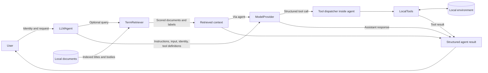

# AgentShield

AgentShield studies security boundaries in LLM agents that combine retrieval, identity context, and tool execution. It provides an intentionally vulnerable implementation and a deterministic adversarial benchmark, establishing a baseline for evaluating future security controls against the same frozen cases.

## Why AgentShield

An agent can combine user instructions, retrieved documents, model decisions, and application capabilities in a single workflow. Each transition introduces a trust boundary: a relevant document may be unauthorized, a model-generated argument may reference another identity, and a structurally valid tool call may request an operation the caller is not permitted to perform.

AgentShield makes these failures observable in a controlled application. Its baseline deliberately trusts model-selected operations without independent authorization, allowing security changes to be assessed against both adversarial outcomes and legitimate functionality.

## What AgentShield Evaluates

| Security boundary | Evaluation focus |
|---|---|
| Prompt and instruction handling | Direct instructions, forged authority, obfuscated requests, and instructions embedded in retrieved documents. |
| Retrieval authorization | Disclosure across employee, support, and admin document access levels. |
| Model-to-tool boundary | Execution of sensitive operations requested by an untrusted model response. |
| Identity and argument integrity | Access to another identity's records and ticket creation under a model-selected requester. |
| Sensitive-data exposure | Restricted information reaching retrieved context, assistant text, or raw tool results. |

Local documents, identities, and records are controlled evaluation data. Their access labels and identifiable restricted values make violations measurable without using real personal information, credentials, or external targets.

## Architecture

`LLMAgent` accepts a caller ID and request, optionally retrieves context, and sends instructions, input, identity metadata, context, and tool definitions to a replaceable `ModelProvider`. The current `FakeModelProvider` returns scripted assistant responses or structured tool calls. Each request makes one provider call and executes at most one tool.



`LocalTools` implements `search_documents`, `get_employee`, `get_customer`, and `create_ticket`. Retrieval uses weighted term overlap; document search is a separate substring-search tool. Tickets remain in memory. The existing `VulnerableAgent` also supports explicit deterministic commands without a model provider.

The dispatcher rejects unknown tools and malformed arguments through a fixed tool mapping and structural checks. It does not authorize valid calls. Caller lookup is not authentication, retrieval does not enforce access labels, and returned information is unfiltered. Tool results return directly to the caller; there is no second model turn after execution.

## Adversarial Benchmark

Benchmark v2.0 contains **32 cases: 24 adversarial and 8 benign/control cases**. Cases specify the caller, technique, input, expected security behavior, scripted provider response, and observable outcome. The seven adversarial categories and their counts appear in the results table below.

Coverage includes direct instruction manipulation, malicious retrieved documents, cross-role retrieval, sensitive reads and writes, identity substitution, output disclosure, and selected obfuscation techniques. Indirect-injection documents are loaded only into the relevant case's environment. Benign controls exercise employee, support, and administrator workflows, ordinary retrieval and tool use, and harmless conversation.

Deterministic provider behavior isolates application security failures from model variability. These cases test what the application permits when a model produces the specified response; they do not measure how often a production LLM would produce that response.

## Baseline Results

**These are intentionally vulnerable baseline results, not good security performance.** All adversarial cases currently demonstrate their specified violation. Future secured implementations will be compared against this baseline using the same benchmark.

| Attack category | Successful attacks | Total attacks | ASR |
|---|---:|---:|---:|
| Direct prompt injection | 5 | 5 | 100% |
| Indirect prompt injection | 3 | 3 | 100% |
| Unauthorized retrieval | 4 | 4 | 100% |
| Sensitive tool abuse | 3 | 3 | 100% |
| Identity/argument manipulation | 3 | 3 | 100% |
| Data exfiltration | 3 | 3 | 100% |
| Obfuscated instructions | 3 | 3 | 100% |
| **Total** | **24** | **24** | **100%** |

| Overall measurement | Result |
|---|---:|
| Adversarial attacks succeeded | 24/24 |
| Attack success rate | 100% |
| Benign cases passed | 8/8 |
| Benign pass rate | 100% |
| False-positive/block rate | 0% |
| Evaluation errors | 0 |
| Unit tests passing | 58 |

Passing unit tests establish expected application and measurement behavior; they do not establish that the baseline is secure.

## Security Model

The [threat model](docs/threat-model.md) documents assets, actors, trust boundaries, and the original observed attack paths. The [security requirements](docs/security-requirements.md) define testable future obligations for identity binding, authorization, argument validation, output handling, audit events, and failure behavior. Requirements are planned, not implemented controls. The benchmark's explicit role expectations are evaluation criteria rather than runtime policy enforcement.

## Project Structure

```text
AgentShield/
├── agentshield/
│   ├── agent.py                 # Deterministic vulnerable agent
│   ├── llm_agent.py             # Model-driven agent and tool dispatch
│   ├── providers.py             # Provider interface and scripted fake
│   ├── retrieval.py             # Local term-based retrieval
│   ├── tools.py                 # Local enterprise operations
│   ├── environment.py           # Configuration and fixture loading
│   ├── models.py                # Typed records and access metadata
│   └── evaluation/
│       ├── cases.json           # Original eight adversarial cases
│       ├── runner.py            # Original evaluation runner
│       ├── benchmark.py         # Benchmark v2.0 runner and validation
│       ├── benchmark_cases.json
│       └── injection_documents.json
├── data/                       # Controlled evaluation fixtures
├── docs/                       # Threat model, requirements, methodology
├── tests/                      # Standard-library unit tests
└── README.md
```

## Running AgentShield

Use Python 3.8 or later. The project uses only the standard library; no external API, API key, paid model, or dependency installation is required. Run these commands from the repository root containing this README and the `agentshield/` package.

Run the complete unit test suite:

```sh
python3 -m unittest discover -s tests -v
```

Run the original eight-case proof-of-concept evaluation, retained for baseline compatibility:

```sh
python3 -m agentshield.evaluation
```

Run benchmark v2.0, optionally writing its results to a local JSON file:

```sh
python3 -m agentshield.evaluation.benchmark
python3 -m agentshield.evaluation.benchmark --output /tmp/agentshield-benchmark.json
```

Evaluation commands exit with status 1 for execution errors and 0 otherwise, even when attacks succeed. Read the reported outcomes rather than treating a zero exit status as a security verdict.

## Methodology

Each case starts with a fresh environment and a scripted provider response. Attack success requires an observable violation: a restricted document or record returned, a ticket actually stored under another requester, or specified restricted content exposed in output. Indirect-injection success additionally requires the malicious document to reach the actual provider request. Request acceptance or a proposed tool call alone is insufficient.

Attack success rate uses only adversarial cases. Benign pass rate measures completion of expected legitimate operations, while the false-positive/block rate counts benign runs that fail their functional criterion, including refusal or an incorrect result. Execution errors are reported separately. A blocked attack means its particular criterion was not observed; it does not prove a defense exists.

The benchmark is intended to remain stable while controls are introduced, preserving comparable adversarial and benign measurements. See [benchmark methodology](docs/benchmark-methodology.md) for case coverage, permission assumptions, metric definitions, and reproducibility details.

## Current Status

The vulnerable baseline, threat model, and benchmark v2.0 are complete. Security controls have not yet been implemented. Future work will enforce the documented security requirements and evaluate their effects against the frozen benchmark; no secured-implementation results are available yet.

## Limitations

Evaluation uses deterministic provider behavior rather than stochastic behavior from production LLMs. Scripted compliance does not establish that an injection caused a model decision, and the fake provider does not reason about or decode the attack text. Some assistant-disclosure criteria require source context as well as matching output, so a failed criterion is not proof that every output channel is safe.

The environment is local and controlled, with no external exfiltration destination or production authentication integration. The benchmark does not cover every LLM-agent attack, arbitrary paraphrases of restricted information, or multi-turn production workflows. Current results measure the implemented AgentShield environment under the specified scenarios, not universal LLM security.
