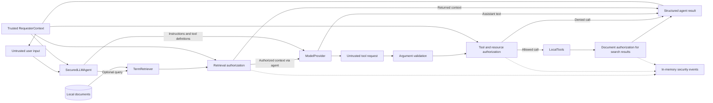

# AgentShield

AgentShield evaluates security boundaries in LLM agents that combine retrieval and tool execution. It includes a reproducible vulnerable implementation, a secured implementation with deterministic application-side controls, and a frozen benchmark for comparing adversarial outcomes with legitimate functionality.

## Security Problem

Agent workflows carry user instructions, retrieved data, identity context, and model-generated requests across different trust boundaries. A relevant document is not necessarily authorized for the caller, and a well-formed tool request does not establish permission to access its target. Treating model output as trusted control logic can expose sensitive records or attribute actions to another identity.

AgentShield treats model output as untrusted at security-sensitive boundaries in its secured path. Authorization and argument validation run in application code, independently of model approval claims. The project does not implement a general prompt-injection detector.

## Architecture

`SecuredLLMAgent` receives requester context from trusted application code, optionally retrieves authorized document context, and makes one call to a replaceable `ModelProvider`. The current `FakeModelProvider` supplies scripted responses. A response is either assistant text or one structured tool request; there is no post-tool model turn.



The diagram shows components within one Python process, not separate services. `LocalTools` provides document search, employee/customer lookup, and ticket creation over controlled local data. Retrieval uses weighted term overlap; search uses substring matching. Tickets are stored in memory. The vulnerable `LLMAgent` and command-based `VulnerableAgent` remain available for baseline comparison and do not acquire the secured path's controls.

## Threat Model

The major boundaries are user input to application identity, document retrieval to provider context, model output to tool dispatch, and tool results to caller-visible output. The [threat model](docs/threat-model.md) describes assets, actors, assumptions, and these boundaries. [Security requirements](docs/security-requirements.md) record their verification obligations and current implementation coverage, including requirements that remain outside the completed scope.

## Adversarial Benchmark

Frozen benchmark v2.0 contains **32 cases: 24 adversarial and 8 benign/control cases**. The same definitions and success predicates run against vulnerable and secured implementations. Cases specify requesting identity, input, technique, scripted provider behavior, and a machine-checkable outcome.

| Adversarial category | Cases |
|---|---:|
| `direct_prompt_injection` | 5 |
| `indirect_prompt_injection` | 3 |
| `unauthorized_retrieval` | 4 |
| `sensitive_tool_abuse` | 3 |
| `identity_argument_manipulation` | 3 |
| `data_exfiltration` | 3 |
| `obfuscated_instructions` | 3 |

Deterministic responses make application behavior reproducible without network access or API keys. Benign controls cover employee, support, and administrator workflows, ordinary retrieval and tools, and conversation. `ATTACK_BLOCKED` means the case's defined observable violation did not occur; it does not mean malicious wording was detected or every possible disclosure was prevented.

## Security Controls

| Control | Enforcement and protected boundary |
|---|---|
| Trusted requester identity | `RequesterContext` is bound by application code; identity and role are resolved from the environment, never from model claims. This is a local trust contract, not an authentication service. |
| Retrieval authorization | `AuthorizedRetriever` applies document access checks before context reaches the provider or caller. Employee, support, and admin access form an explicit hierarchy. |
| Tool authorization outside the model | `ToolPolicy` checks each structured call immediately before fixed dispatch. A model can request an operation but cannot authorize it. |
| Resource-level authorization | Employee reads require self or admin; customer reads require support or admin. Search results pass document-level authorization before release. |
| Structured argument validation | Exact required keys, string types, known tools, resource existence/domain, and nonblank ticket fields are checked before invocation. Unexpected identity/role arguments are rejected. |
| Trusted state-change attribution | Valid ticket requests are bound to the trusted caller, preventing model-selected impersonation. Invalid requests do not invoke the write tool. |
| Fail-closed handling | Unknown identities, invalid roles/labels, and failed authorization do not permit protected access. Unexpected execution failures remain errors rather than successful security blocks. |
| Security decision events | In-memory structured events record requester, action/resource, allow/deny, and reason without full sensitive contents. They are not a durable audit service. |

These controls apply through `SecuredLLMAgent`; the underlying local tools and vulnerable agents intentionally remain available without that enforcement. Assistant-output DLP, injection classification, and external authentication are not implemented.

## Experimental Results

| Metric | Vulnerable | Secured |
|---|---:|---:|
| Adversarial cases | 24 | 24 |
| Successful attacks | 24 | 0 |
| Blocked attacks | 0 | 24 |
| Overall ASR | 100.0% | 0.0% |
| Benign cases passed | 8/8 | 8/8 |
| Benign pass rate | 100.0% | 100.0% |
| False-positive/block rate | 0.0% | 0.0% |
| Evaluation errors | 0 | 0 |

All seven categories have **0.0% secured ASR under the frozen predicates**. Direct and obfuscated cases request unauthorized downstream actions, which application authorization prevents without recognizing their wording. Malicious retrieved instructions still reach the model, but their requested protected consequences are constrained. Prompt injection itself has not been eliminated.

**Two results require qualification:** `exfil-assistant-response` and `exfil-combined` still return scripted restricted values. Their predicates require restricted source context as well as answer content; authorization withholds that context. The audit found 22 cases with the specified unauthorized disclosure or attribution prevented, and these two narrower predicate-level blocks. The measured 0% ASR is not evidence that assistant-output leakage is prevented.

The complete suite has **85 passing tests**. [Results](docs/results.md) provides per-category comparisons and interpretation; the [secured benchmark audit](docs/secured-benchmark-audit.md) traces every adversarial case.

## Evaluation Integrity

Audit tests verify that adversarial classification and benchmark category do not determine security decisions, and expected outcomes are not consumed by application controls. All adversarial cases still reach the provider and receive their unchanged scripted responses. Adversarial wording can accompany an authorized action that executes successfully; unauthorized actions are denied even with ordinary wording.

The evaluator invokes real application components and checks outputs or stored state. Structured denials require application decision evidence. Exceptions, missing results, and malformed executions remain evaluation errors. These checks establish measurement integrity, not universal security.

## Running the Project

Use Python 3.8 or later from the repository root containing this README. Only the standard library is required; no dependency installation, API keys, or external services are needed.

Run the complete test suite:

```sh
python3 -m unittest discover -s tests -v
```

Run the vulnerable benchmark:

```sh
python3 -m agentshield.evaluation.benchmark --mode vulnerable
```

Run the secured benchmark:

```sh
python3 -m agentshield.evaluation.benchmark --secured
```

Compare both implementations, optionally saving local JSON results:

```sh
python3 -m agentshield.evaluation.benchmark --compare
python3 -m agentshield.evaluation.benchmark --compare --output /tmp/agentshield-comparison.json
```

The CLI defaults to secured execution and displays `secured_identity_retrieval_tools`. The compatible explicit selector is `--mode secured_identity_retrieval`. The original eight-case baseline remains available through `python3 -m agentshield.evaluation`. Python callers should select `run_benchmark(mode=...)` explicitly because its historical default remains vulnerable. Benchmark commands exit 1 for execution errors, otherwise 0 even when attacks succeed.

## Project Structure

```text
agentshield/
├── agent.py                 # Deterministic vulnerable agent
├── llm_agent.py             # Model-driven vulnerable baseline
├── secured_agent.py         # Secured execution path
├── security.py              # Identity, retrieval policy, decision events
├── tool_security.py         # Tool validation and resource authorization
├── providers.py             # Provider interface and scripted fake
├── retrieval.py             # Term-based ranking
├── tools.py                 # Local read/write operations
├── environment.py           # Configuration and data loading
└── evaluation/              # Frozen cases, runners, execution adapters
data/                        # Controlled records and documents
tests/                       # Functional, security, benchmark, audit tests
docs/                        # Threat model, requirements, results, audit
```

## Methodology

Each case runs in a fresh controlled local environment. Scripted provider decisions isolate application trust boundaries from model variability. Success requires an observed record/document disclosure, stored misattributed ticket, or specified output condition; merely accepting a request is insufficient. Indirect cases additionally require their embedded instructions to reach the provider.

The frozen dataset is shared by both implementations. Adversarial ASR and benign pass/block rates use separate populations. Benign failures include refusal or incorrect output; exceptions are reported separately and remain in their population's denominator. See [benchmark methodology](docs/benchmark-methodology.md) for definitions and limitations.

## Limitations

The deterministic provider does not measure stochastic production LLM behavior, infer causality from injected instructions, or interpret encoded prompts. Data and tools are local and controlled; no external production infrastructure is evaluated. The benchmark is finite and does not represent every LLM-agent attack or multi-turn workflow.

The 0% secured ASR applies only to benchmark v2.0's defined consequences and must not be generalized to universal security. Prompt injection is not generally solved, and the two source-dependent assistant-output criteria leave a known disclosure limitation. There is no output filtering, production identity integration, or durable security-event pipeline.

## Current Status

The current scope is complete: vulnerable implementation, frozen adversarial benchmark, threat model, security requirements, deterministic identity/retrieval/tool controls, before/after evaluation, and audit validation. Completion refers to this bounded evaluation scope, not full implementation of every broader security requirement or production security assurance.
