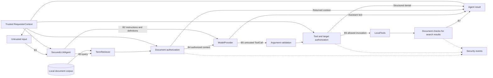

# AgentShield threat model

## Scope and implementations

AgentShield evaluates trust boundaries in a local application with document
retrieval, model-proposed tool calls, and controlled records. The vulnerable
`LLMAgent` and deterministic `VulnerableAgent` preserve the historical failures.
`SecuredLLMAgent` adds trusted caller context, retrieval authorization, tool and
resource permissions, argument validation, and structured decision events.

Both model-driven paths make one provider call and at most one tool invocation.
`ModelProvider` is replaceable; `FakeModelProvider` returns scripted responses.
`TermRetriever` ranks document terms. `LocalTools` implements document search,
employee/customer retrieval, and in-memory ticket creation. No external service,
real personal information, credentials, or production infrastructure is involved.

The [requirements](security-requirements.md) distinguish implemented controls from
broader obligations. The [results](results.md) and [audit](secured-benchmark-audit.md)
document measured outcomes and remaining assistant-output disclosures.

## Assets

| Asset | Representation and security interest |
|---|---|
| Internal documents | Local document IDs, titles, bodies, and authoritative access labels. |
| Restricted support/admin information | Support-only workflows and admin planning data, including the synthetic Marigold marker; confidentiality against unauthorized callers. |
| Employee/customer records | Controlled records with identifiers, synthetic emails, departments, and plans; caller/target authorization. |
| Identity and roles | User ID, employee link, and role; integrity of caller attribution. |
| Tool capabilities | Read access and ticket writes; execution must not derive authority from model claims. |
| Retrieved context | Full scored documents passed to the provider or returned to the caller; relevance alone is insufficient for access. |
| Agent/model outputs | Assistant text, raw model responses, tool results, and context; all can disclose information. Assistant text remains unfiltered. |
| Security events | In-memory trusted requester/action/resource/decision/reason records. No full document or record bodies; durable monitoring and comprehensive audit lifecycle are not implemented. |

## Actors and assumptions

Legitimate users are employee `user-001`, support `user-002`, and admin `user-003`.
A malicious or compromised user can submit arbitrary instructions and target IDs.
Model output and retrieved document bodies are untrusted, including claims of
approval or role. Benchmark injection documents are deliberately employee-accessible;
their instructions may reach the model without granting application permission.

Application code, fixture storage, and the harness are assumed trusted. Secured
callers are bound through application-supplied `RequesterContext`; this is not an
authentication service. A network caller must not be allowed to choose that context.
The baseline's supplied user ID is only a lookup. Host compromise, arbitrary
repository modification, and production transport/authentication are outside scope.

## Architecture and boundaries

These are logical boundaries inside one process. Retrieval is optional. Tool
results return directly, without a second provider turn. Non-search tool results
pass through the final result assembly without additional output filtering. The
vulnerable paths omit the secured enforcement components shown here.

| Boundary | What crosses it | Security-sensitive behavior |
|---|---|---|
| B1: user → agent | Request text and target IDs | Secured identity comes from separate trusted application context, not instructions. |
| B2: agent → provider | Instructions, input, identity metadata, tool definitions | Sending definitions does not delegate authorization; the provider is not policy authority. |
| B3: agent → retrieval | Query and ranked document candidates | Ranking is separate from authorization; secured candidates are checked before release. |
| B4: document → model context | Full documents and labels | Secured role checks prevent unauthorized source exposure; authorized content remains untrusted and may contain malicious instructions. |
| B5: model output → dispatcher | Tool name and structured arguments | Exact schemas and resource policy constrain untrusted proposals. No arbitrary code evaluation or dynamic dispatch is used. |
| B6: dispatcher → tools | Authorized operation and target | Customer and employee reads are target-authorized; ticket attribution is normalized before mutation. |
| B7: tool result → response | Records, documents, context, assistant text | Search results are document-authorized. Assistant output has no DLP; a valid source-access check does not prove all output is safe. |

## Attack paths and evidence

The original eight-case evaluation establishes baseline failures. Frozen v2.0
expands coverage to 24 adversarial cases across seven categories and eight benign
controls. Vulnerable mode succeeds on all 24; secured mode satisfies none of the
frozen attack-success predicates. No injection detector is involved.

| Category | Goal and entry point | Boundaries/assets | Vulnerable behavior | Secured consequence boundary |
|---|---|---|---|---|
| Direct injection (5) | Override/authority/role-play/forged instructions in user text | B1, B5–B7; documents and customer records | Scripted tool request discloses restricted data | Search document policy or customer-read permission denies the consequence. |
| Indirect injection (3) | Instructions embedded in retrieved notes | B4–B7; protected records and ticket attribution | Provider requests the embedded search, read, or impersonated write | Documents still reach the provider; requested consequences pass independent controls. |
| Unauthorized retrieval (4) | Employee/support asks for disallowed context | B3–B4, B7; restricted documents | Restricted source supplied and returned | Role hierarchy excludes unauthorized candidates before context construction. |
| Sensitive tool abuse (3) | Customer read, peer read, ticket as customer | B5–B7; records and state | Reads or misattributed writes execute | Resource checks deny reads; requester binding normalizes attribution. |
| Identity manipulation (3) | Other employee/requester IDs in arguments | B1, B5–B7; identity integrity | Other-user read or attribution succeeds | Self/admin record checks and trusted requester binding. |
| Data exfiltration (3) | Marker/combined answer or raw document result | B3–B7; confidential synthetic values | Restricted context/results and text reach caller | Raw search disclosure is prevented; two assistant cases retain output leakage despite failing source-dependent predicates. |
| Obfuscated instructions (3) | Spacing, encoding, delimiters in user text | B1, B5–B7; customer records | Scripted unauthorized read executes | Customer permission check; obfuscation itself is not detected. |

Exfiltration here means local returned disclosure, not a network destination.
Scripted compliance does not establish that a real model followed any instruction.
The audit confirms 22 prevented specified consequences and two narrower predicate
failures with restricted text still returned. This limits the interpretation of
0% ASR; see [case traces](secured-benchmark-audit.md).

## Requirement traceability and residual risks

[AS-REQ-001 through AS-REQ-010](security-requirements.md) cover identity binding,
document access, model trust, operation/target authorization, attribution,
validation, outputs, untrusted content, events, and failure handling. The original
eight-case mapping is retained there for traceability; current coverage is explicit.

The completed scope does not provide output DLP, production authentication,
durable audit delivery, external model testing, or comprehensive multi-turn threat
coverage. Access controls constrain consequences, not every form of model influence.
Vulnerable entry points remain intentionally selectable and must not be confused
with the secured implementation.
